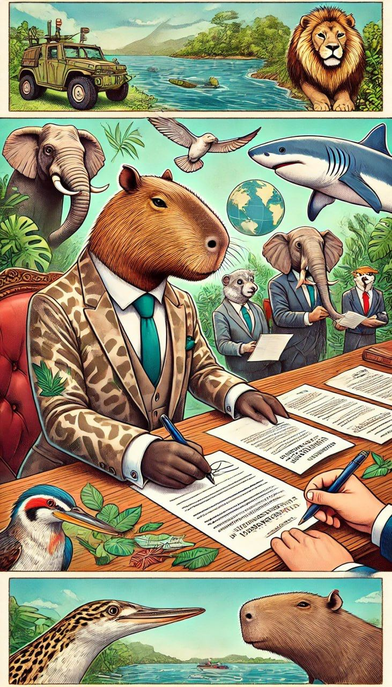

# Fun Facts

1. **Ambassador of Goodwill ��**

<figure><figcaption>
<strong>Capybara signs friendship treaties and paves the way for joint environmental protection projects</strong>
</figcaption></figure>

<figure><figcaption>
<strong>Capybara visits various environments, from tropical forests to deserts and oceans</strong>
</figcaption></figure>

<figure><figcaption>
<strong>The friendly Capybara, dressed in a stylish suit and preparing for a diplomatic mission in a vibrant and animated office setting.</strong>
</figcaption></figure>

2. **Healing Friend🌟**

<figure><figcaption>
<strong>Capybara, a healer, brings joy and relaxation through natural therapies.</strong>
</figcaption></figure>

3. **Heathy lifestyle🌟**

<figure><figcaption>
<strong>Capybara loves sports, promoting active and healthy lifestyle</strong>
</figcaption></figure>
